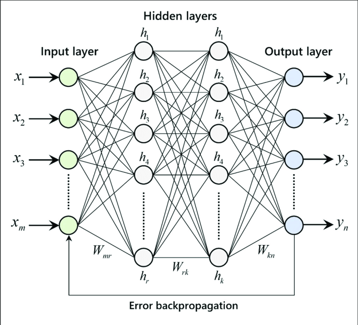

# Regression-Model-in-ANN

## Linear Regression
Linear Regression is a supervised learning technique that involves learning the relationship between the features and the target. The target values are continuous, which means that the values can take any values between an interval. For example, 1.2, 2.4, and 5.6 are considered to be continuous values. Use-cases of regression include stock market price prediction, house price prediction, sales prediction, and etc.

The y hat is called the hypothesis function. The objective of linear regression is to learn the parameters in the hypothesis function. The model parameters are, intercept (beta 0) and the slope (beta 1). The above equation is valid for univariate data, which means there is only one column in the data as a feature.

## Regression using Artificial Neural Networks
Why do we need to use Artificial Neural Networks for Regression instead of simply using Linear Regression?

The purpose of using Artificial Neural Networks for Regression over Linear Regression is that the linear regression can only learn the linear relationship between the features and target and therefore cannot learn the complex non-linear relationship. In order to learn the complex non-linear relationship between the features and target, we are in need of other techniques. One of those techniques is to use Artificial Neural Networks. Artificial Neural Networks have the ability to learn the complex relationship between the features and target due to the presence of activation function in each layer. Let’s look at what are Artificial Neural Networks and how do they work.

 

## Artificial Neural Networks
Artificial Neural Networks are one of the deep learning algorithms that simulate the workings of neurons in the human brain. There are many types of Artificial Neural Networks, Vanilla Neural Networks, Recurrent Neural Networks, and Convolutional Neural Networks. The Vanilla Neural Networks have the ability to handle structured data only, whereas the Recurrent Neural Networks and Convolutional Neural Networks have the ability to handle unstructured data very well. In this post, we are going to use Vanilla Neural Networks to perform the Regression Analysis.

# Structure of Artificial Neural Networks

The Artificial Neural Networks consists of the Input layer, Hidden layers, Output layer. The hidden layer can be more than one in number. Each layer consists of n number of neurons. Each layer will be having an Activation Function associated with each of the neurons. The activation function is the function that is responsible for introducing non-linearity in the relationship. In our case, the output layer must contain a linear activation function. Each layer can also have regularizers associated with it. Regularizers are responsible for preventing overfitting.

## Artificial Neural Networks consists of two phases,

Forward Propagation
Backward Propagation
Forward propagation is the process of multiplying weights with each feature and adding them. The bias is also added to the result. Backward propagation is the process of updating the weights in the model. Backward propagation requires an optimization function and a loss function.
